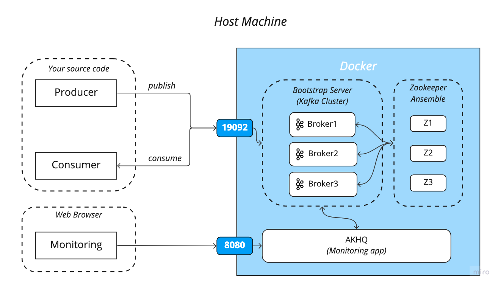

# Kafka demo
## Kafka Environment settings

Base docker-based architecture is as follows:


```shell
docker-compose -f <target-file> up [-d]
```
* Target file

    You should execute the commands below in `docker/` directory. Otherwise, volume files are created in project root directory.
    * `docker/kafka-single.yml`
  
        This is for single kafka broker and single zookeeper environment.
        ```shell
      $ pwd # <your path>/python-kafka/docker
      $ docker-compose -f kafka-single.yml up
        ```

    * `docker/kafka-cluster.yml`
    
        This is for kafka basic cluster environment with 3 broker and 3 zookeepers.
      ```shell
      docker-compose -f kafka-cluster.yml up
        ```

    * `docker/kafka-monitoring.yml`_**(2023.01.20 updated)**_
    
        This is for kafka single broker with ELF monitoring system.
      ```shell
      docker-compose -f kafka-monitoring.yml up
        ```
* Basic commands
    
    This section is for basic commands to control docker based environment. You can also use them in GUI environment with [Docker Desktop](https://www.docker.com/products/docker-desktop/).
  * Stop containers
     ```shell
    docker-compose -f <target-file> stop
    ```
  * Remove containers
     ```shell
    docker-compose -f <target-file> down
    ```
  * Remove container volume
     ```shell
    docker volume prune -y
    ```

### Error Handling
If the cluster setting is not working, it might be due to those two reasons.
1. Authentication problem for volume directory.
    
    I recommend you to remove shared volume file and try it again.
    ```shell
   rm -rf docker/kafka docker/zookeeper
   docker volume prune
   docker-compose -f <traget-file> up
   ```
   Otherwise, you need to change authentication in file by using `chmod` linux commands
   ```shell
    sudo chmod u+w docker/
    ```
   
2. Docker resources problems.
        
    You should increase the CPU and memory resources that docker can use in Docker Desktop. You can modify the limitation in Docker **_Desktop > Preferences > Resources_**.

## Kafka Monitoring (2023.01.20 updated)
You can use kafka monitoring system AKHQ. You can find out more information in [here](https://akhq.io/).
* How to access: http://localhost:8080
* (Recommended) Live tail option is really useful to track kafka records in real-time.

### ELK monitoring system
You can use ELK monitoring system for kafka when you compose-up `kafka-monitoring.yml`. This is only track broker metrics in `docker/logstash/config/jmx_conf`.

* Kibana(monitoring dashboard): http://localhost:5601
* Elasticsearch: http://localhost:9200

## Kafka Client
* python version: Python 3.9
```shell
pip install - r requirements.txt
```
### Create Topic
```shell
python create_topic.py [ --config <config file path> ] [ --topic_config <topic config file path> ]
```
* config file path is set to "_config/v1.ini_" by default.
* topic config file path is set to "_config/topic/v1.ini_" by default.

### Publish Messages
* You need to execute Flask server first.
    ```
  python flaskserver.py
  ```
* Test API: GET http://localhost/sensordata/10
  * You should receive 200 status.
```shell
python publish_topic.py [ --count <number of data> ] [ --delay <delay sec per publishing> ]
```
* Number of data is set to 10 and delay of per publishing is set to 0.5sec by default.

### Consume Messages

```shell
python consume_data.py [ --config <config file path> ]
```

* Since consumer is executed under infinite loop, you need to signal Ctrl+C interrupt to exit program.